# CatalogPro B2B

Sistema full stack de catalogo corporativo B2B com solicitacao de orcamento e painel administrativo.

O CatalogPro B2B simula uma solucao para empresas que vendem produtos por orcamento. O cliente acessa o catalogo, pesquisa produtos, filtra por categoria ou marca, adiciona itens a uma cotacao e envia uma solicitacao comercial. A empresa acompanha as solicitacoes em um painel administrativo, visualiza os detalhes e atualiza o status do atendimento.

## Demonstracao

- Site em producao: https://catalogpro-b2b.vercel.app/
- Painel admin: https://catalogpro-b2b.vercel.app/admin
- API: https://catalogpro-b2b-api.onrender.com/api/health

> Observacao: a API esta hospedada no Render e pode apresentar cold start no primeiro acesso.

## Objetivo

Demonstrar uma aplicacao full stack completa, com front-end, back-end, banco de dados, API REST, deploy, integracao entre servicos e painel administrativo.

O projeto foi desenvolvido como case de portfolio para representar um cenario comercial real: empresas B2B que precisam apresentar produtos de forma profissional e receber solicitacoes de orcamento de maneira organizada.

## Funcionalidades

### Area publica

- Home institucional
- Catalogo de produtos
- Busca por nome, categoria, marca e SKU
- Filtros por categoria e marca
- Modal com detalhes do produto
- Lista de cotacao
- Controle de quantidade dos itens
- Remocao de produtos da cotacao
- Formulario de orcamento
- Envio de solicitacao
- Envio para WhatsApp
- Feedback visual ao adicionar produto
- Estados de loading, erro, vazio e sucesso
- Layout responsivo para desktop e mobile
- Fallback caso a API esteja temporariamente indisponivel

### Painel administrativo

- Dashboard de cotacoes
- Metricas por status
- Listagem de solicitacoes
- Visualizacao de detalhes da cotacao
- Dados do cliente
- Produtos solicitados
- Alteracao de status da cotacao
- Layout adaptado para desktop e mobile

### Status das cotacoes

- `NEW` - nova cotacao
- `IN_REVIEW` - em analise
- `ANSWERED` - respondida
- `CLOSED` - fechada

## Tecnologias

### Front-end

- React
- Vite
- JavaScript
- CSS puro
- Vercel

### Back-end

- Node.js
- Express
- Prisma ORM
- PostgreSQL
- Render

### Ferramentas

- Git
- GitHub
- npm
- Variaveis de ambiente
- API REST

## Arquitetura

```txt
Usuario
  |
  v
Front-end React/Vite - Vercel
  |
  v
API REST Node/Express - Render
  |
  v
Prisma ORM
  |
  v
PostgreSQL - Render
```

## Estrutura do projeto

```txt
CatalogPro B2B/
|-- catalogpro-b2b/     # Front-end React/Vite
|-- backend/            # API Node/Express/Prisma
`-- docs/
    `-- screenshots/    # Prints do projeto para documentacao
```

## Endpoints principais da API

```txt
GET    /api/health
GET    /api/products
GET    /api/categories
GET    /api/brands
GET    /api/quotes
GET    /api/quotes/:id
POST   /api/quotes
PATCH  /api/quotes/:id/status
```

## Fluxo principal

```txt
Cliente acessa o site
|
v
Visualiza o catalogo
|
v
Pesquisa ou filtra produtos
|
v
Abre detalhes do produto
|
v
Adiciona produtos a cotacao
|
v
Abre a lista de cotacao
|
v
Preenche o formulario
|
v
Envia a solicitacao
|
v
Empresa acompanha no painel admin
|
v
Empresa altera o status do atendimento
```

## Screenshots

### Home desktop

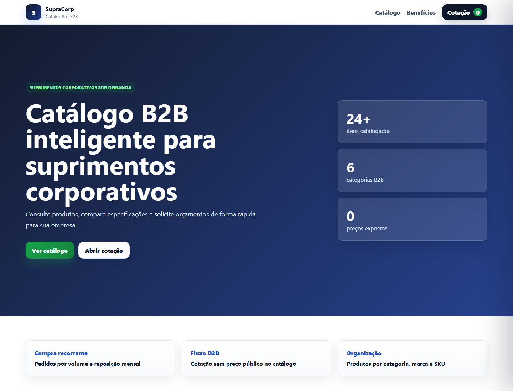

### Catalogo desktop

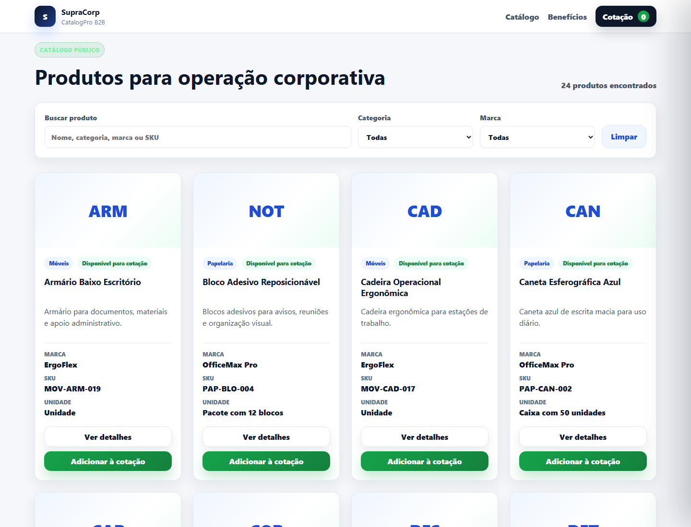

### Filtros do catalogo

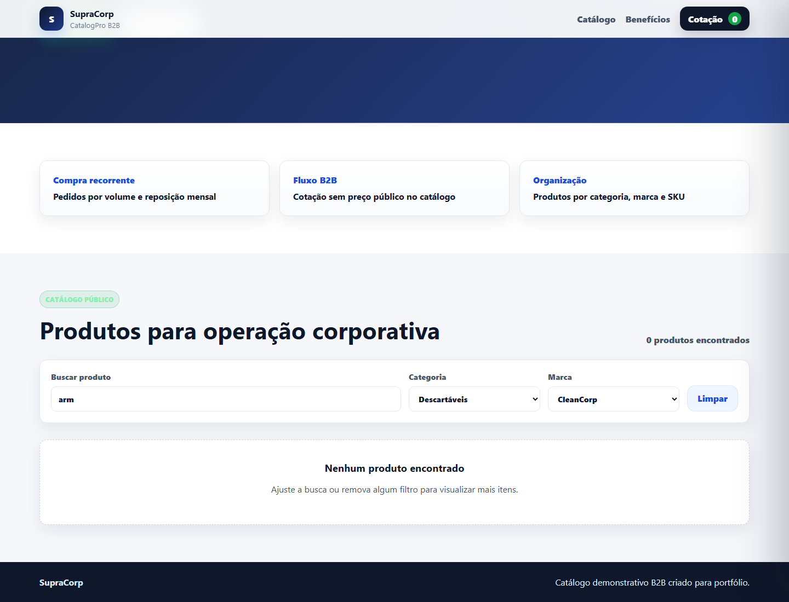

### Modal de produto

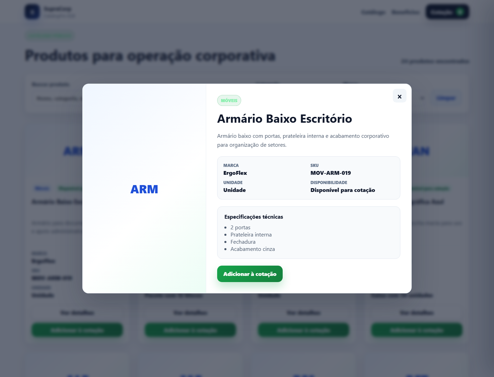

### Drawer de cotacao

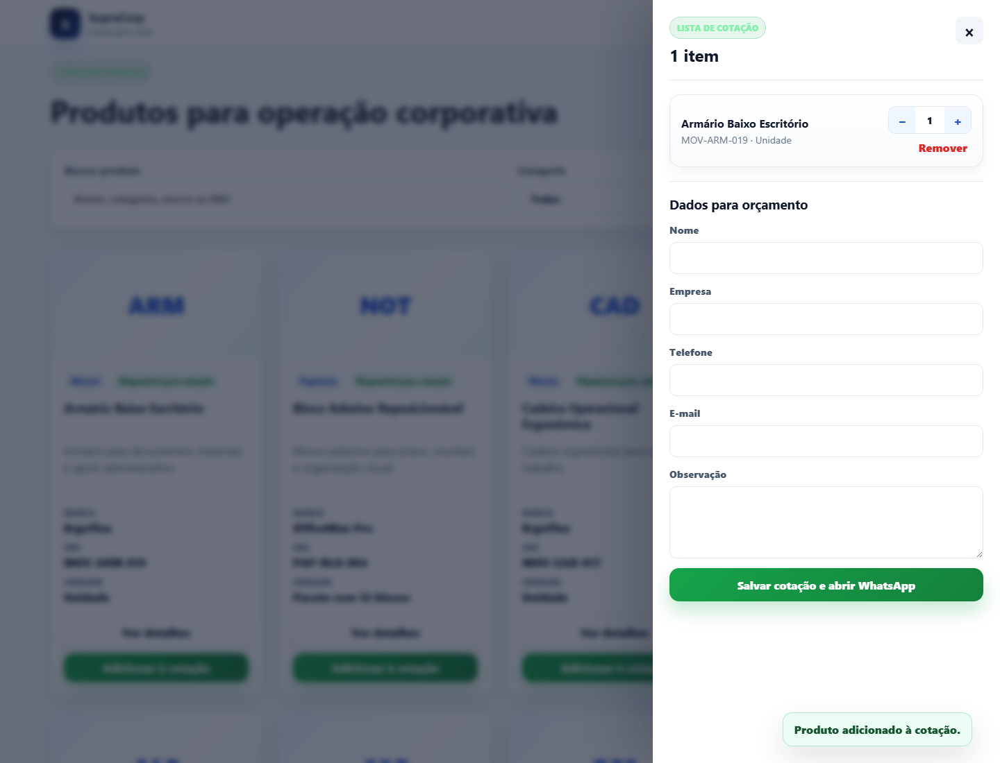

### Formulario de orcamento


### Admin dashboard


### Detalhe da cotacao

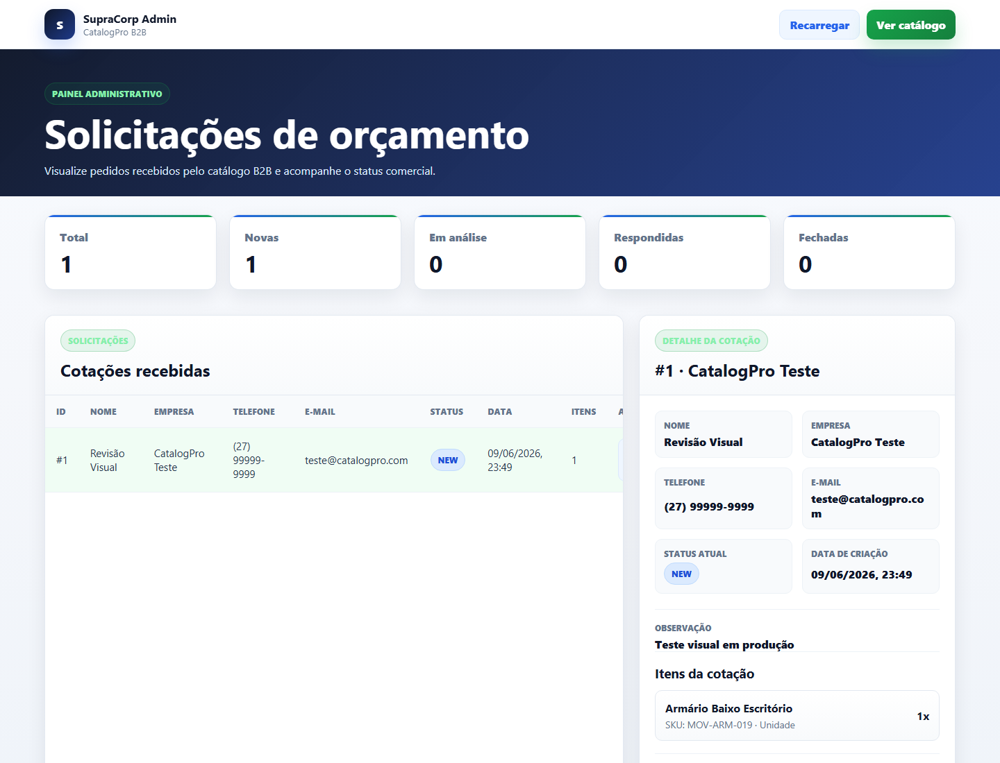

### Atualizacao de status

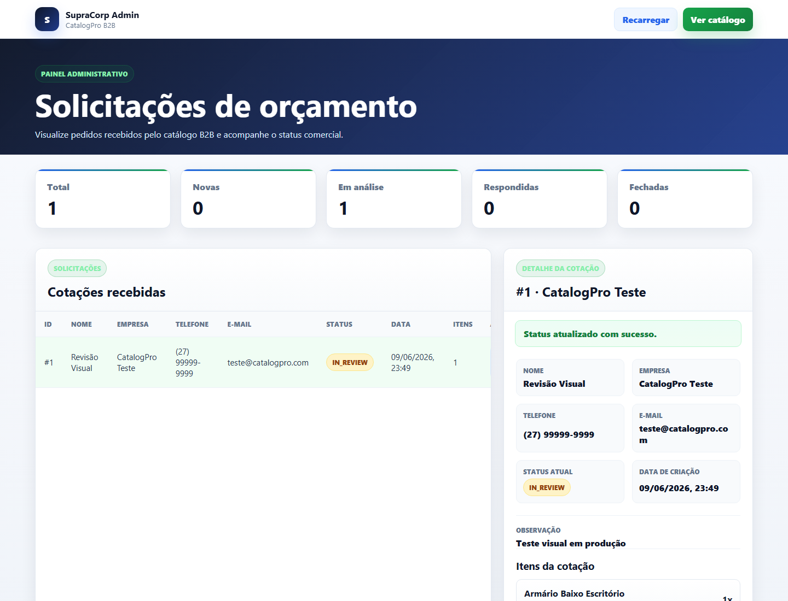

### Mobile

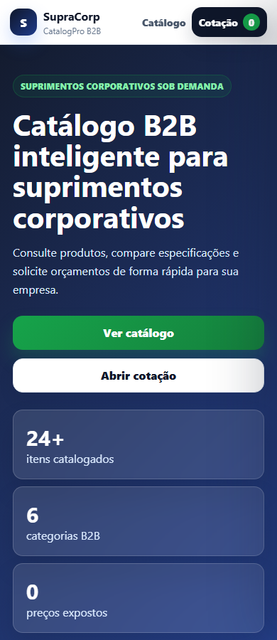

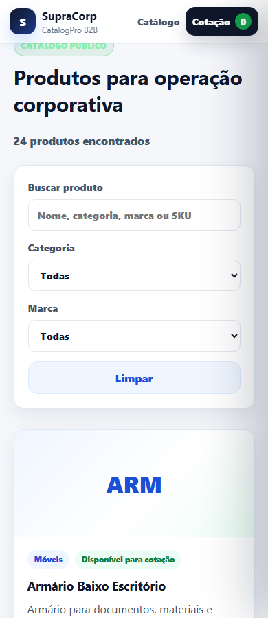

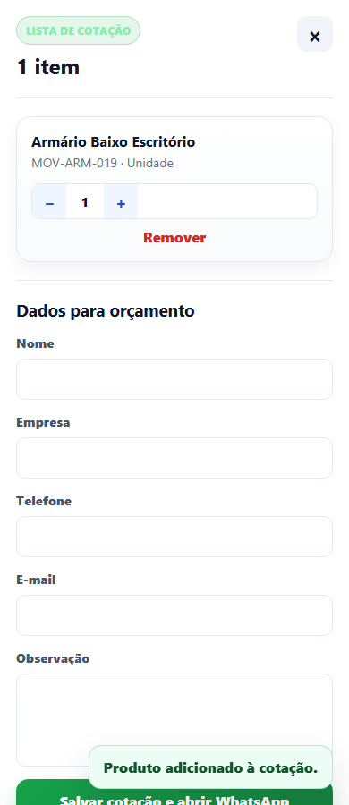

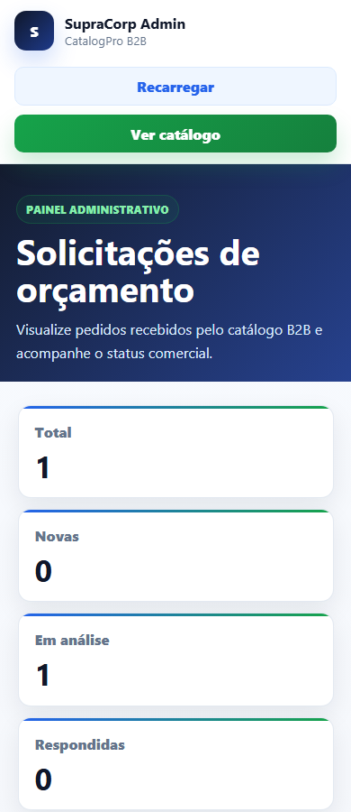

## Como rodar localmente

### Pre-requisitos

- Node.js
- npm
- PostgreSQL
- Git

### Clonar o repositorio

```bash
git clone https://github.com/RhanielRodri/catalogpro-b2b.git
cd catalogpro-b2b
```

## Front-end

```bash
cd catalogpro-b2b
npm install
npm run dev
```

Arquivo `.env` do front-end:

```env
VITE_API_URL=http://localhost:3333/api
```

Para usar a API online:

```env
VITE_API_URL=https://catalogpro-b2b-api.onrender.com/api
```

## Back-end

```bash
cd backend
npm install
```

Arquivo `.env` do back-end:

```env
DATABASE_URL="sua_url_do_postgresql"
FRONTEND_URL="http://localhost:5173"
PORT=3333
```

Rodar migracoes com Prisma:

```bash
npm run prisma:deploy
```

Rodar seed:

```bash
npm run prisma:seed
```

Iniciar a API:

```bash
npm run dev
```

## Build do front-end

```bash
cd catalogpro-b2b
npm run build
```

## Build do back-end

```bash
cd backend
npm run build
```

## Deploy

O projeto foi publicado com front-end, back-end e banco separados:

```txt
Front-end: Vercel
Back-end/API: Render
Banco de dados: PostgreSQL no Render
```

Variavel de ambiente usada no front-end em producao:

```env
VITE_API_URL=https://catalogpro-b2b-api.onrender.com/api
```

Variaveis principais do back-end em producao:

```env
DATABASE_URL=URL do PostgreSQL no Render
FRONTEND_URL=https://catalogpro-b2b.vercel.app
```

## Validacao final

QA final realizado com sucesso:

- Build do front-end aprovado
- API online respondendo HTTP 200
- Produtos carregando em producao
- Modal de produto funcionando
- Cotacao funcionando
- Drawer abrindo manualmente
- Formulario de orcamento exibido corretamente
- Admin carregando cotacoes
- Detalhe da cotacao funcionando
- Atualizacao de status funcionando via PATCH
- Layout validado em desktop e mobile

## Commits importantes

```txt
7a4fce3 feat: inicia frontend publico do catalogpro b2b
ac8f8f3 fix: revisa e estabiliza frontend do catalogpro b2b
4746a5b feat: adiciona backend inicial do catalogpro b2b
ffb8aff fix: estabiliza backend do catalogpro b2b
85a7284 feat: integra frontend com api do catalogpro b2b
06bff31 feat: adiciona painel admin de cotacoes
67dcbb0 chore: prepara backend para deploy com postgresql
58acc5e ux: ajusta abertura manual da cotacao
93aada3 style: lapida experiencia premium do catalogpro b2b
38f015f chore: finaliza qa visual e prints do catalogpro b2b
```

## O que este projeto demonstra

Este projeto demonstra dominio pratico de:

- Construcao de interfaces com React
- Componentizacao
- Consumo de API REST
- Manipulacao de estado no front-end
- Formularios
- Filtros e busca
- Criacao de API com Node.js e Express
- Modelagem de dados com Prisma
- Banco relacional PostgreSQL
- Deploy separado de front-end e back-end
- Integracao entre Vercel, Render e PostgreSQL
- Variaveis de ambiente
- Responsividade
- UX para aplicacoes comerciais
- Painel administrativo
- Fluxo real de solicitacao de orcamento

## Possiveis melhorias futuras

- Autenticacao para o painel administrativo
- CRUD de produtos
- CRUD de categorias e marcas
- Upload de imagens
- Envio de e-mail automatico
- Historico de alteracoes de status
- Dashboard com graficos
- Paginacao no catalogo e no admin
- Testes automatizados
- Area de login para clientes

## Autor

Desenvolvido por Rhaniel Rodrigues.

GitHub: https://github.com/RhanielRodri
